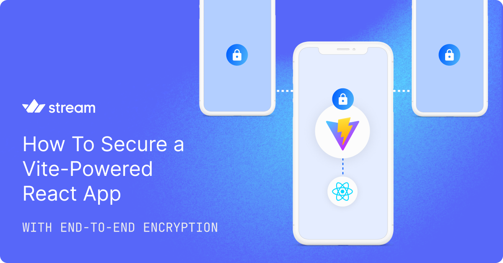

# Secure a React Chat App With Seald's End-to-End Encryption

Integrate the highest layer of security into a chat app built upon [Stream](https://getstream.io/) to protect users' messages, media, and conversation history using [Seald](https://www.seald.io/).

## Run the project

This project is a Next.js application using the [Seald](https://docs.seald.io/en/sdk/) and [Stream Chat React SDK](https://getstream.io/chat/sdk/react/). You can use a GitHub Code Space to run the app or run it locally on your device. The `.env` file in the GitHub project requires your Seald credentials as well as your Stream project credentials (find a sample for the `.env` file in the [/.env.template] file). 

**Note**: Running the final project requires Stream and Seald SDKs credentials. Signup for [Stream](https://getstream.io/try-for-free/) and [Seald](https://dashboard.staging-0.seald.io/) accounts and follow the first article below to get started. The second article introduces you to fundamental concepts of E2EE. 

## Read our E2EE articles
- [Main Article: React App E2EE](https://getstream.io/blog/react-app-encryption)
- [E2EE Concepts: Encrypting an App End-to-End](https://getstream.io/blog/end-to-end-encryption)  

